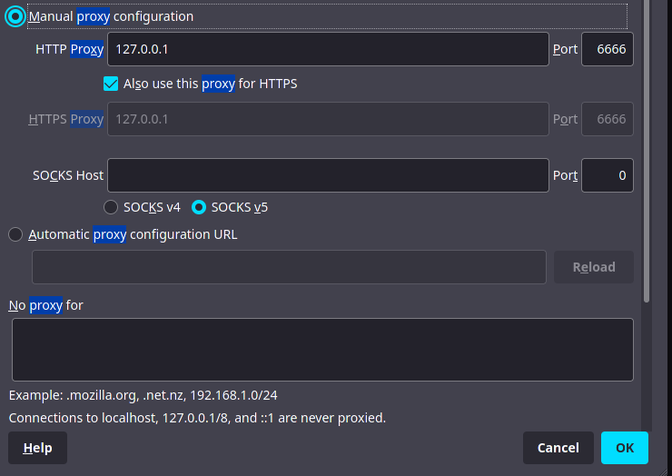
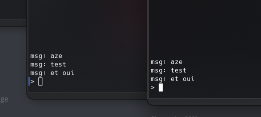

# Cassys


*Working In early beta* ^_-

[Open the wiki page](https://github.com/Sn0wAlice/Cassys/wiki)

# Record

## Infos
> All the multiple target Are in beta testing __ONLY__

All record exemples are in `./type/${TYPE_NAME}/exemple.json` to copy past conf :) <br>

### Cassys port
Cassys **DO NOT** use port **53** like classic DNS, but port **6969**, consider use this command (with your config): 
```
sudo iptables -t nat -A PREROUTING -i eth0 -p tcp --dport 53 -j REDIRECT --to-port 6969
sudo iptables -t nat -A PREROUTING -i eth0 -p udp --dport 53 -j REDIRECT --to-port 6969
```

## Database organisation
The file architecture is: `./db/${DOMAIN}/${HOSTNAME}/${SUB1}/${SUB2}/${TYPE}.json`<br>
__Exemple__: 
- testing.cassys.cnil.me / CNAME
- `./db/me/cnil/cassys/testing/CNAME.json`

# Record Support
- A `beta`
- AAAA `unstable` 0.o
- CNAME `beta`
- MX `beta`
- NS `beta`
- SOA `beta`
- SRV `beta`
- TXT `beta`

# Lauch the app

`deno run -A --unsable --no-check dns.ts`

# Network Special layers

## - DNS tunneling

- The client is in `./clients/tunneling/main.ts`<br>
- Configure the client (Hostname + Port)<br>
- Connect your proxy of Firefox on it:<br>
<br>

> And tada, it's working ! 0.o

## - Chat
- The client is in `./clients/chat/main.js`<br>
- Install deps with `npm i`<br>
- Configure the client (Hostname + Port)<br>
- `node client.js`<br>
<br>

> Beta project. But working. Please wait for update ^.-

# Copy Past Zone

## Github Page Conf: 
```
EXAMPLE.COM     3600    IN A        185.199.108.153
EXAMPLE.COM     3600    IN AAAA     2606:50c0:8000::153
```
